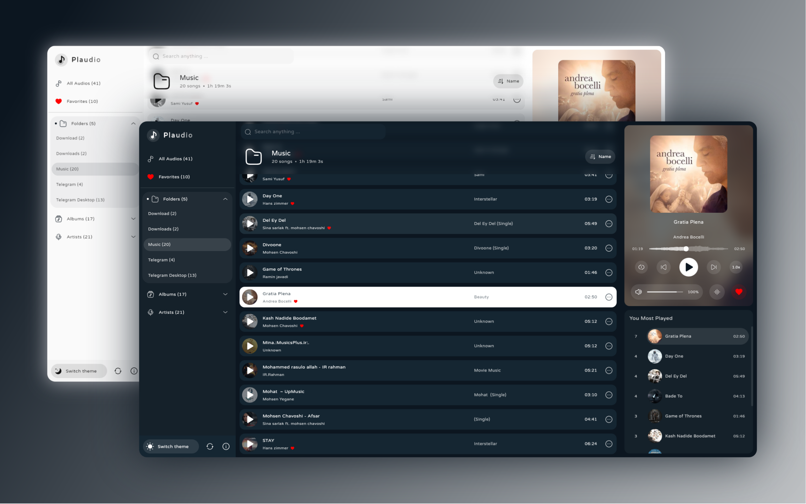

## This Project is Deprecated. Use [Orange Player](https://github.com/SudoDios/OrangePlayer) instead of this

<h1 align="center">Plaudio</h1>
<h6 align="center">An open source beautiful audio player and tag editor for desktop with compose</h6>

### 📷 Screenshot

### 🚀 Features

> - Beautiful design
> - Responsive
> - Searching all your audios in (MP3,M4A,OGG,WAV,FLAC) Formats
> - Fetching all folders contains audios
> - Fetching albums & artists from audios
> - You can edit audios (IDV3) tags
> - Equalizer presets support
> - & more ...

### 📥 Installation

> 1. Plaudio need to install **LibVLC** on your system
>    - on version 1.5.0 plaudio use bundled libvlc (WIP)
>      - that means you don't need to install libvlc
>      - this is work in windows 64x & linux 64x
> 
> 2. Download Plaudio
>     - Debian based linux x64 (**DEB** file) [Download](https://github.com/SudoDios/Plaudio/releases/download/1.5.0/plaudio_1.5.0_amd64.deb)
>     - Linux x64 (**AppImage** file) [Download](https://github.com/SudoDios/Plaudio/releases/download/1.5.0/Plaudio-1.5.0-x86_64.AppImage)
>     - Windows x64 (**EXE** installer) [Download](https://github.com/SudoDios/Plaudio/releases/download/1.5.0/plaudio_1.5.0_installer_win_x64.exe)
> 
> Tested on : `Ubuntu 18-20 & Windows 10-11`
> 
> Note : `currently, it does not support 32x and macOS versions (But you can help in this way to make it complete)` See [this](https://github.com/SudoDios/Plaudio/issues/3)

### 🔧 Build

> - You need to install (open)jdk-18 on your system
> - `git clone project`
> - `cd Plaudio`
> - `./gradlew run`

### 🌊 Waveform (optional)

> - If you want to show plaudio waves, **ffmpeg** must be installed on your system
> - plaudio does the rest

### ✅ Todo

> - [ ] TrayIcon
> - [x] ReSync to merge new files (& folders)
> - [x] More tag fields edit
> - [x] Make resizable window
> - [ ] Playlist feature
> - [x] Light Theme
> - [x] Drag & Drop Audio Files
> - [x] Bundled libvlc (WIP)

### 📚 Libraries

> - [Odyssey](https://github.com/AlexGladkov/Odyssey) navigations
> - [Jaudiotagger](https://bitbucket.org/ijabz/jaudiotagger/src/master/README.md) tag editor
> - [vlcj](https://github.com/caprica/vlcj) libvlc binding
> - [sqlite-jdbc](https://github.com/xerial/sqlite-jdbc) sqlite driver
> - [solarIconsSet](https://www.figma.com/community/file/1166831539721848736) Icons
> - And I thank compose multiplatform ❤️

## 🧾 License
Copyright (C) 2023 SudoDios
http://www.apache.org/licenses/LICENSE-2.0
