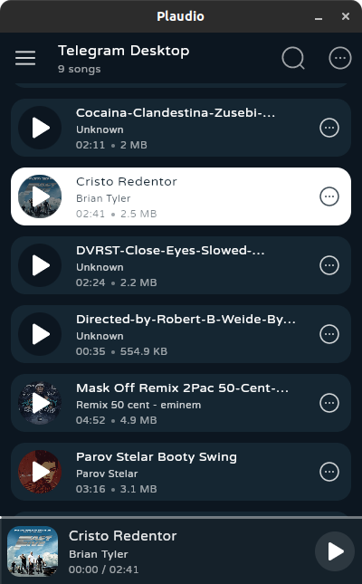
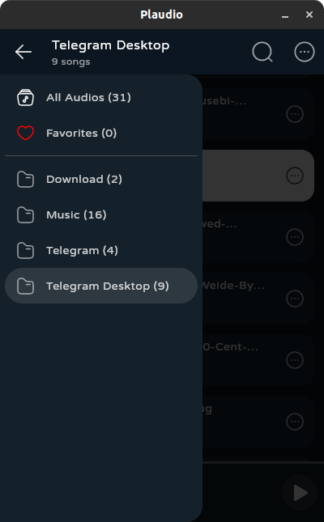
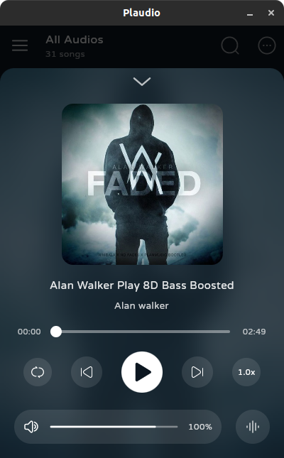
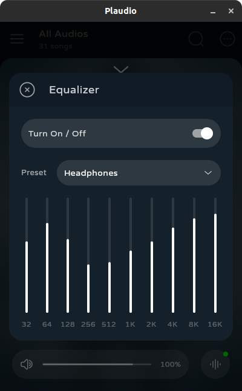
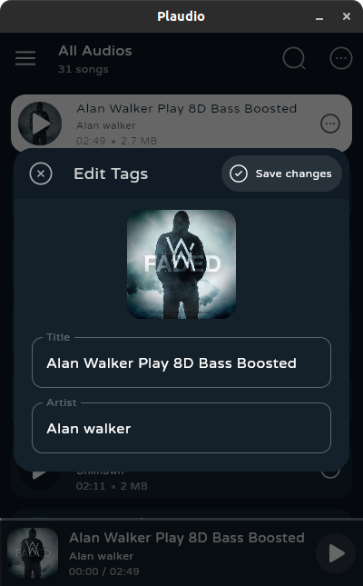
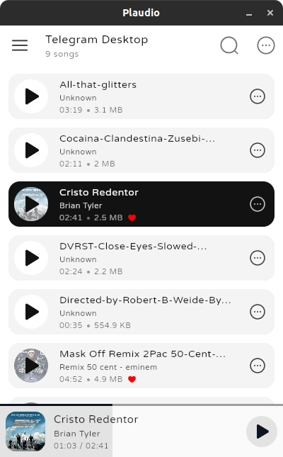

<h1 align="center">Plaudio</h1>
<h6 align="center">An open source beautiful audio player and tag editor for desktop with compose</h6>

### Screenshots

|                                                  |                                                  |                                                       |
|--------------------------------------------------|--------------------------------------------------|-------------------------------------------------------|
|  |  |       |
|  |  |  |

### Features

> - Beauty design
> - Searching all your audios in (MP3,M4A,OGG) Formats
> - Fetching all folders contains audios
> - You can edit audios (IDV3) tags
> - Equalizer presets support
> - & more ...

### Installation

> 1. Plaudio need to install **LibVLC** on your system
>    - on Linux : `sudo apt install libvlc-dev`
>    - on windows : 
>      - download vlc win from [this](https://mirror.rasanegar.com/videolan/vlc/3.0.18/win64/vlc-3.0.18-win64.exe)
>      - install downloaded vlc exe file
> 
> 2. Download Plaudio
>     - for linux (**DEB** file) [Download](https://github.com/SudoDios/Plaudio/releases/download/1.1.1/plaudio_1.1.1_amd64.deb)
>     - for windows (**EXE** installer) [Download](https://github.com/SudoDios/Plaudio/releases/download/1.1.1/plaudio_1.1.1_installer_win.exe)
> 
> `Tested on Ubuntu 18-20 & Windows 10-11`
>

### Build

> - You need to install (open)jdk-18 on your system
> - `git clone project`
> - `cd Plaudio`
> - `./gradlew run`

### Todo

- [ ] TrayIcon
- [ ] ReSync to merge new files (& folders)
- [ ] More tag fields edit
- [ ] Make resizable window
- [ ] Playlist feature
- [x] Light Theme

### Libraries

> - [Odyssey](https://github.com/AlexGladkov/Odyssey) navigations
> - [Jaudiotagger](https://bitbucket.org/ijabz/jaudiotagger/src/master/README.md) tag editor
> - [vlcj](https://github.com/caprica/vlcj) libvlc binding
> - [sqlite-jdbc](https://github.com/xerial/sqlite-jdbc) sqlite driver
> - [solarIconsSet](https://www.figma.com/community/file/1166831539721848736) Icons
> - And I thank compose multiplatform ❤️

## License
Copyright (C) 2023 SudoDios
http://www.apache.org/licenses/LICENSE-2.0